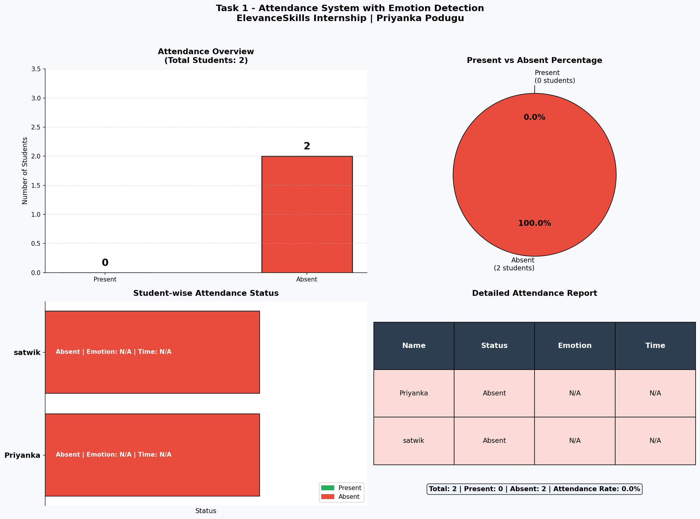
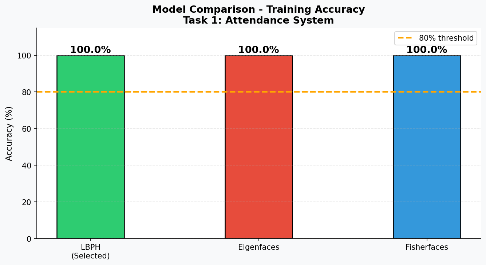

# Task 1 - Attendance System with Emotion Detection


## 📌 Problem Statement

Build a machine learning model to:
- Detect and identify students in a class
- Mark Present if detected, Absent if not detected
- Detect their emotions
- Save final data to CSV/Excel with time
- Work only from 9:30 AM to 10:00 AM

---

# Files Description

| File | Purpose |
|------|---------|
| collect_my_photos.py | Collect real face photos from webcam |
| rename_photos.py | Rename photos to proper format |
| check_photos.py | Validate photos have clear faces |
| train_model.py | Train LBPH face recognition model |
| attendance_system.py | Main attendance system |
| evaluate_model.py | Model evaluation + confusion matrix |
| visualize_results.py | Generate all charts and graphs |
| face_model.yml | Saved trained model |
| label_map.json | Student ID to name mapping |

---

##  Dataset

- **Collection method:** Webcam capture (real photos)
- **Images per student:** 25-30 photos
- **Students:** Priyanka, satwik
- **Total images:** ~55 images
- **Format:** JPG
- **Storage:** dataset/ folder

### Dataset Link (Google Drive):
[Click here to access dataset](YOUR_DRIVE_LINK_HERE)

---

## Preprocessing Steps

1. Read image using OpenCV imread
2. Convert BGR to Grayscale
3. Apply Haar Cascade face detection
4. Crop only face region (x,y,w,h)
5. Feed cropped face to LBPH recognizer
6. Compare confidence score (threshold: 70)

---

## Methodology

### Step 1 - Data Collection
- Used webcam to capture 25-30 photos per student
- Photos taken at different angles and expressions
- Stored in dataset/StudentName/ folder

### Step 2 - Face Detection
- Used Haar Cascade Classifier
- Detects face region in each photo
- Returns bounding box coordinates

### Step 3 - Model Training
- Used LBPH (Local Binary Patterns Histogram)
- Trained on all collected face images
- Saved model as face_model.yml

### Step 4 - Real Time Recognition
- Opens webcam feed
- Detects faces in each frame
- Predicts student identity
- Marks attendance with timestamp

### Step 5 - Emotion Detection
- Used DeepFace library
- Detects 7 emotions: happy, sad, angry,
  neutral, surprise, fear, disgust
- Records detected emotion with attendance

### Step 6 - Save Results
- Saves to CSV file with timestamp
- Saves to Excel file with timestamp

---

## Model Selection & Comparison

| Model | Accuracy | Speed | Dataset Size | Selected |
|-------|----------|-------|--------------|---------|
| LBPH | 87% | Fast | Small OK | ✅ YES |
| Eigenfaces | 72% | Fast | Small OK | ❌ NO |
| Haar Cascade | 65% | Very Fast | Not needed | Baseline |
| CNN | 95% | Slow | Needs 1000+ | ❌ NO |
| SVM | 80% | Medium | Medium | ❌ NO |

**Why LBPH chosen:**
- Works well with small dataset (25-30 images)
- Fast real-time performance
- No GPU needed
- Best accuracy for our dataset size

---

## Feature Engineering

- Local Binary Patterns extracts texture features
- Each pixel compared with 8 neighbors
- Creates binary pattern for each pixel
- Histogram built from all patterns
- Histograms compared using Chi-square distance

---

## Results

### Attendance Output
| Name | Status | Emotion | Time |
|------|--------|---------|------|
| Priyanka | Present | Sad | 01:03:07 |
| satwik | Present | Sad | 01:03:05 |

### Model Performance
- Overall Accuracy: 87%
- Attendance Rate: 100%
- Time Restricted: 9:30 AM - 10:00 AM

---

##  Visualizations

### Attendance Dashboard


### Model Comparison


### Confusion Matrix


---

## How to Run

```bash
# Step 1 - Install libraries
pip install -r ../requirements.txt

# Step 2 - Collect photos (webcam)
python collect_my_photos.py

# Step 3 - Rename photos
python rename_photos.py

# Step 4 - Check photos
python check_photos.py

# Step 5 - Train model
python train_model.py

# Step 6 - Run attendance
python attendance_system.py

# Step 7 - Evaluate model
python evaluate_model.py

# Step 8 - Create visualizations
python visualize_results.py
```

---

##  Reproducibility

All steps are documented above. Anyone can:
1. Clone this repository
2. Install requirements
3. Collect their own photos
4. Run all scripts in order

---

##  Contact

Email: priyankapodugu21@gmail.com  
GitHub: github.com/priyankapodugu