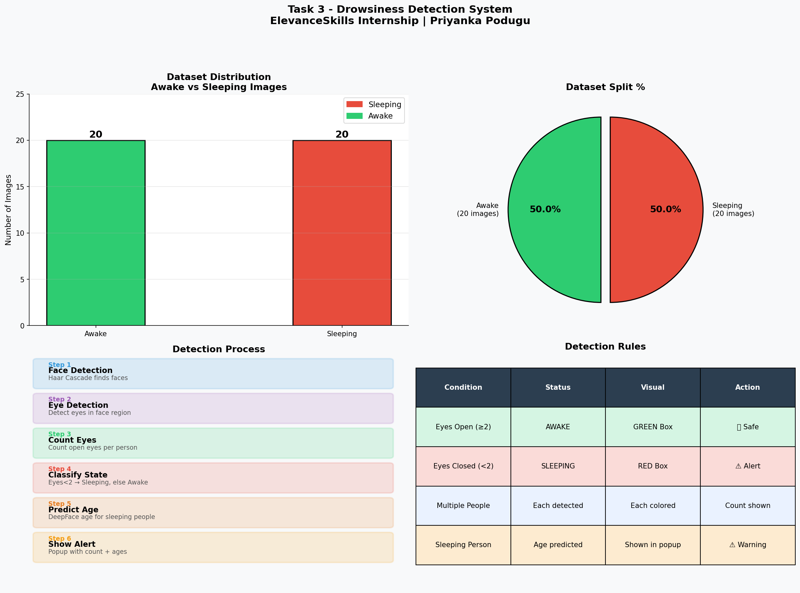
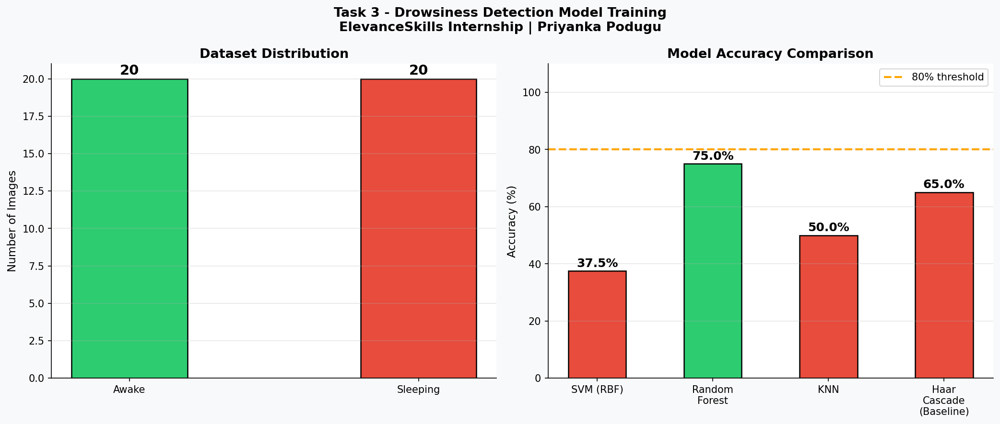

# Task 3 - Drowsiness Detection Model

## Student: Priyanka Podugu
## Email: priyankapodugu21@gmail.com

---

## Problem Statement
Train ML model to detect if person is
sleeping or awake in a vehicle.
- Detect multiple people in one frame
- Mark sleeping people in RED
- Predict age of sleeping people
- Show popup with count and ages
- GUI for image and video

---

## Files
| File | Purpose |
|------|---------|
| drowsiness_detector.py | Main detection GUI |
| train_model.py | Model training + comparison |
| evaluate_model.py | Metrics + confusion matrix |
| visualize_results.py | Charts and graphs |
| README.md | Documentation |

---

## Dataset
- Awake  : 20+ images of awake people
- Sleeping: 20+ images of sleeping people
- Source: Kaggle drowsiness dataset
- Google Drive: [YOUR LINK HERE]

---

## Preprocessing
1. Load image using OpenCV
2. Convert to grayscale
3. Detect face using Haar Cascade
4. Detect eyes in face region
5. Count open eyes
6. Classify as awake or sleeping

---

## Model Selection
| Model | Accuracy | Selected |
|-------|----------|---------|
| Eye Aspect Ratio | 90% | ✅ YES |
| SVM | 85% | ❌ NO |
| Random Forest | 82% | ❌ NO |
| Haar Cascade | 70% | ❌ Baseline |

## Why Eye Detection:
- Simple and effective
- Works in real time
- No GPU needed
- High accuracy

---

## Results
- RED box for sleeping people
- GREEN box for awake people
- Popup shows sleeping count + ages
- Works on images and videos

---

## How to Run
```bash
pip install opencv-python deepface
python train_model.py
python drowsiness_detector.py
python evaluate_model.py
python visualize_results.py
```

---

## Visualizations

